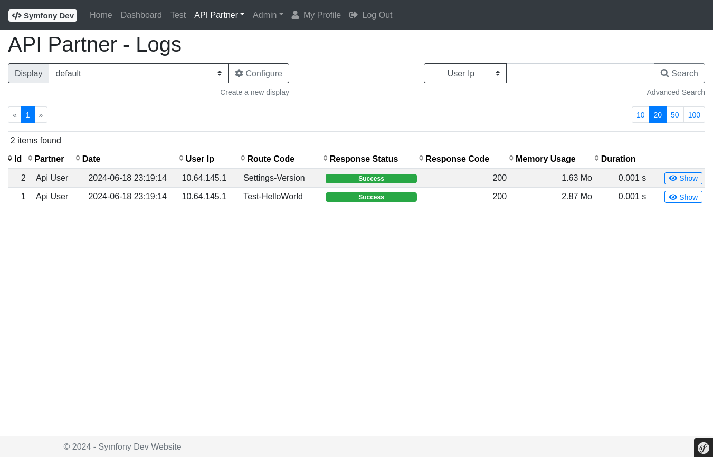
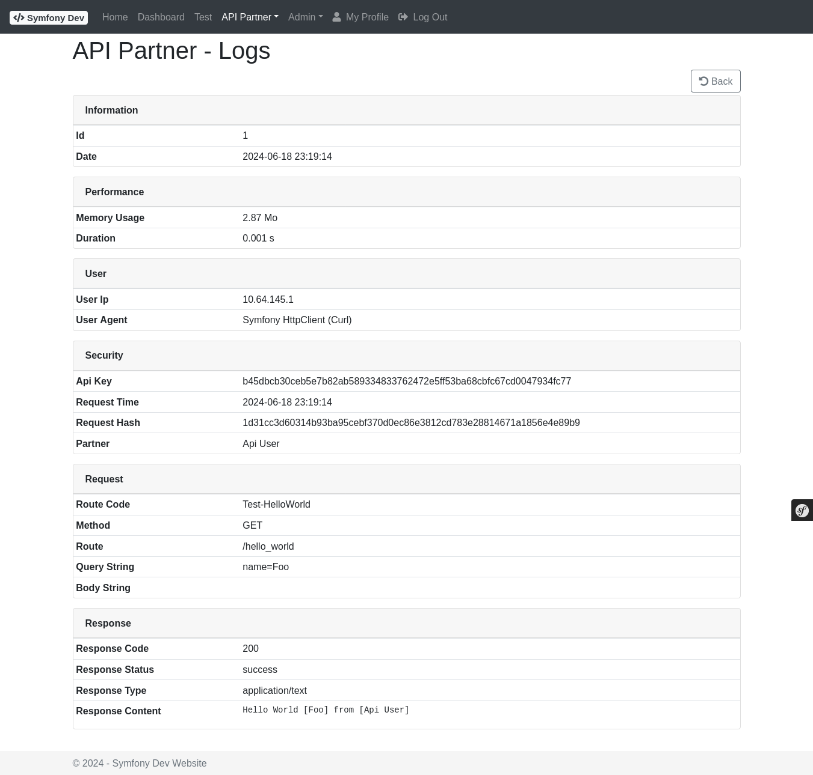
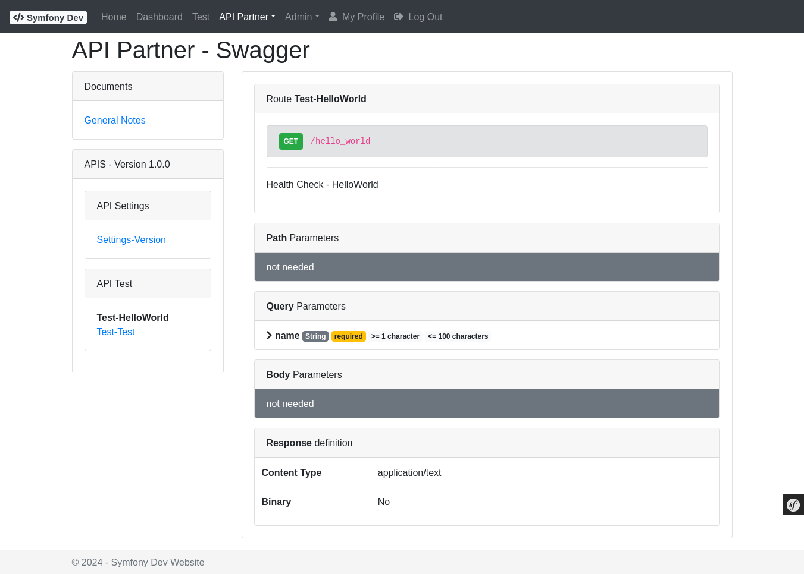

# Bundle - ApiPartner

## Description

The **ApiPartnerBundle** provides a REST API framework for secure partner integrations. Partners authenticate using an API key, and every request is automatically logged:

- **Route registration** — API endpoints are PHP services implementing `RouteInterface` + `ActionInterface`
- **Partner authentication** — partners are identified by an `apiKey`; the application provides the lookup via `PartnerRepositoryInterface`
- **Request security** — the application controls authorization via `RequestSecurityServiceInterface`
- **Typed parameters** — path, query, and body parameters are declared and validated per route
- **Response validation** — optional validation of the response structure
- **Automatic logging** — every request is logged to `ApiLogPartner` (partner, IP, method, route, status, response code, memory, duration)
- **Admin log viewer** — filterable/sortable grid of API logs at `/admin/api-partner/log/`
- **Swagger/OpenAPI** — documentation generation via `AbstractApiDocumentationService`

## Screenshots

