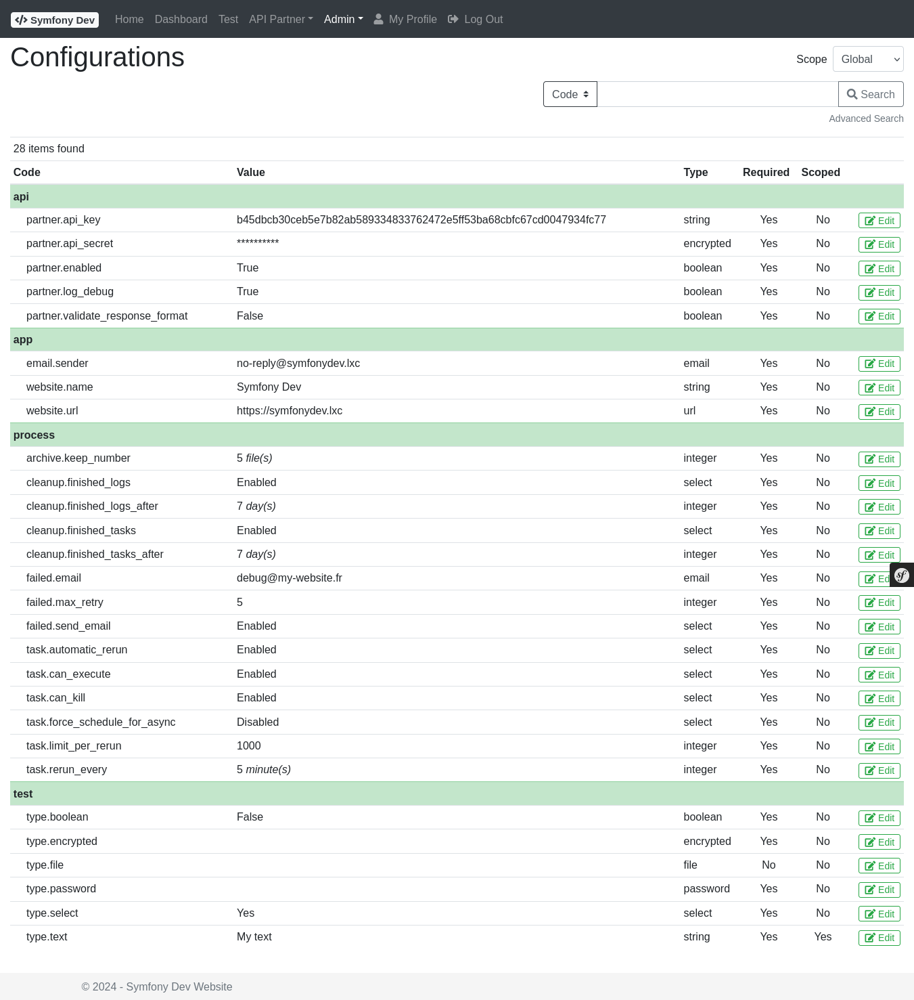
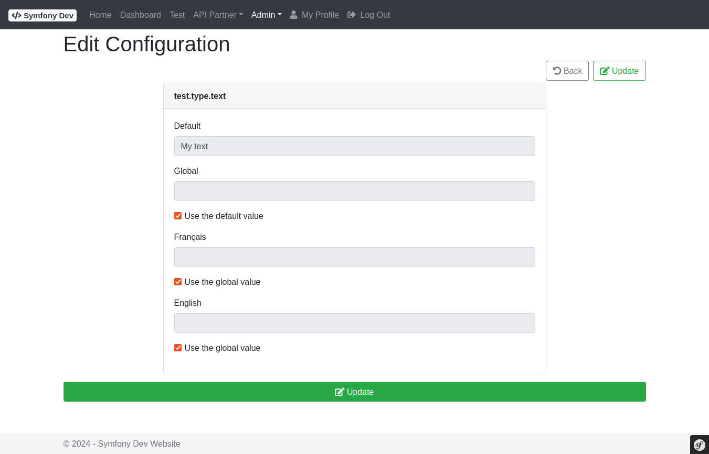

# Bundle - Configuration

## Description

The **ConfigurationBundle** provides a key-value application configuration system with database-backed storage and an admin UI:

- **Key-value store** persisted in database, editable from the admin UI
- **Typed values**: `boolean`, `color`, `email`, `encrypted`, `file`, `float`, `integer`, `password`, `select`, `string`, `text`, `url`
- **Scoped values**: override configurations per scope (e.g., per site, per language)
- **Encrypted storage**: sensitive values are stored encrypted using Sodium (via CoreBundle)
- **Password storage**: password fields are hashed using Symfony's password hasher
- **File upload**: configurations can store uploaded file paths
- **Admin UI**: manage configuration values at `/configuration/list`
- **Console commands**: show, edit, delete, clear-cache, and scope inspection
- **Twig filters**: read configuration values and file URLs from templates
- **Events**: dispatched on every value change (global and per-key)

Full documentation: [README.md](https://github.com/spipu/symfony-bundle-configuration/blob/master/README.md)

## Screenshots

