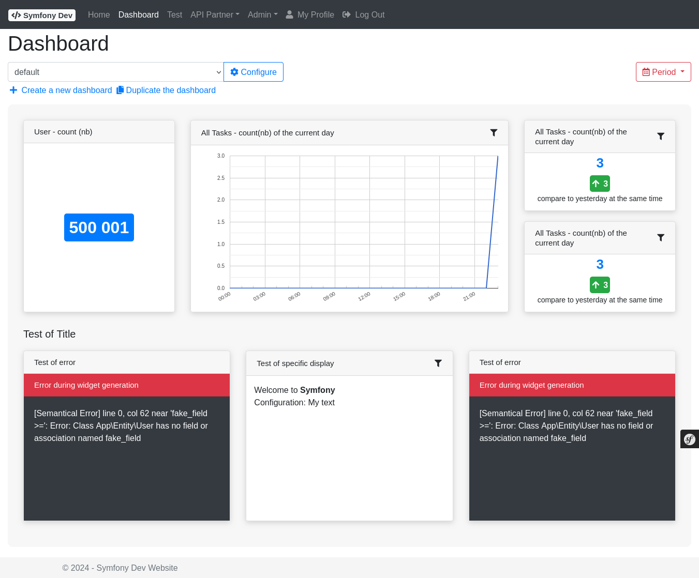
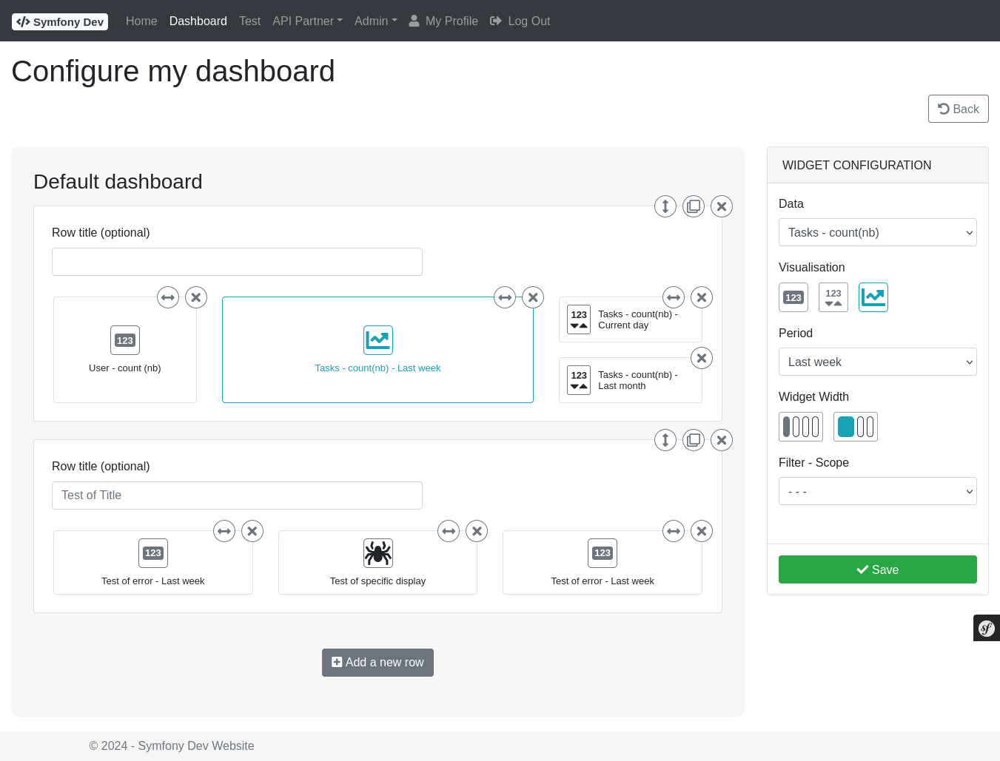

# Bundle - Dashboard

## Description

The **DashboardBundle** provides a widget-based dashboard system. Each widget is a "source" that produces a chart or data display for a configurable time period:

- **Widget sources** — any PHP class can provide dashboard data by implementing `SourceDefinitionInterface` and `SourceDataDefinitionInterface`
- **Period selector** — built-in support for today, yesterday, last 7 days, last 30 days, this month, last month, this year, last year
- **Filters** — widgets can expose filter parameters (dropdowns, date pickers, etc.)
- **Admin UI** — dashboard available at `/admin/dashboard/`
- **Twig rendering** — widgets are rendered using their own Twig templates
- **AJAX refresh** — individual widgets can be refreshed without a full page reload

Full documentation: [README.md](https://github.com/spipu/symfony-bundle-dashboard/blob/master/README.md)

## Screenshots

