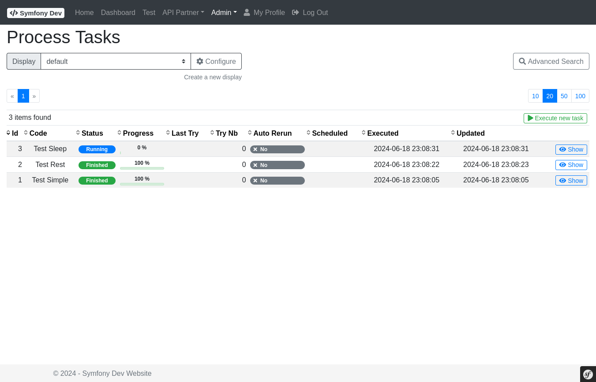
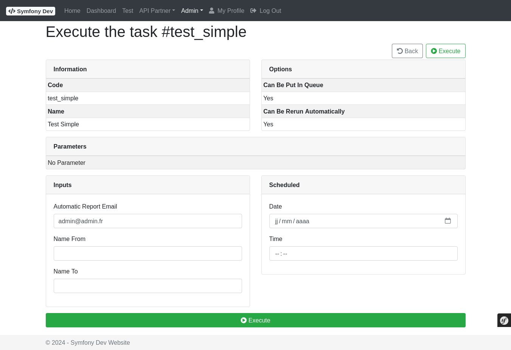
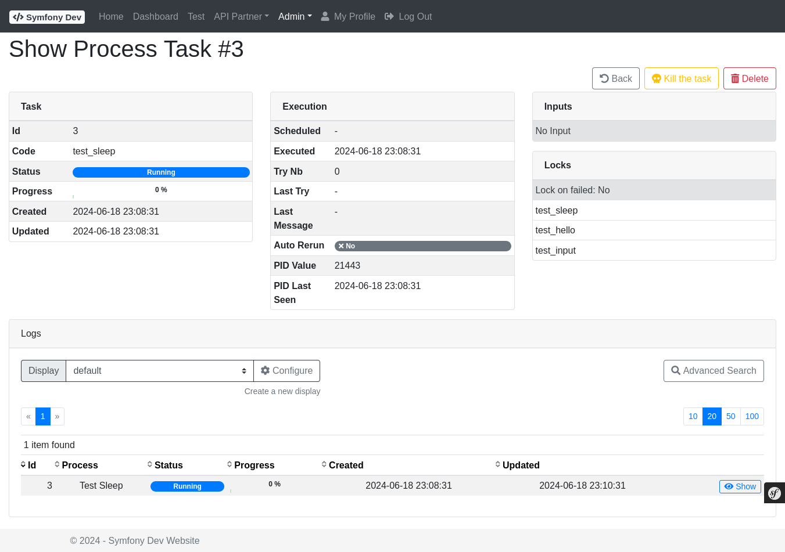
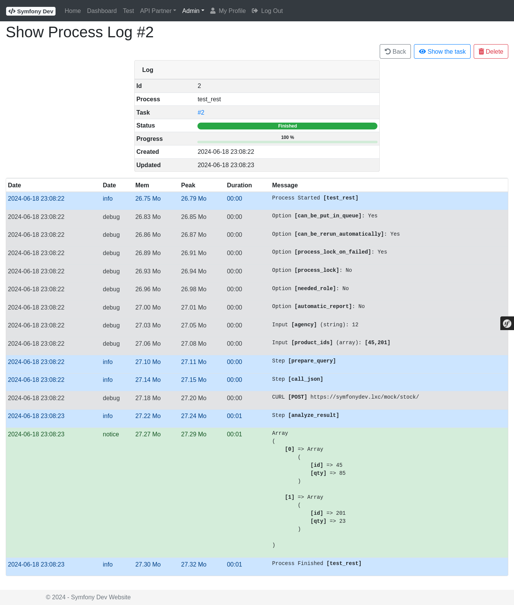

# Bundle - Process

## Description

The **ProcessBundle** is a background job / workflow execution engine. Processes are defined declaratively in YAML as sequences of **steps**:

- **YAML process definitions** — define workflows without writing orchestration code
- **Step-based execution** — each step is a DI container service implementing `StepInterface`
- **Parameter interpolation** — pass and transform values between steps using `{{ variable }}` syntax
- **LoopStep** — iterate over a collection, executing a sub-sequence of steps per item
- **Queue support** — processes can be put in an async execution queue
- **Admin UI** — list, run, schedule, and monitor processes at `/admin/process/`
- **Task log** — per-execution log with status (`created`, `running`, `finished`, `failed`)
- **Email on failure** — send an alert email when a process fails
- **Automatic retry** — failed processes can be retried automatically
- **File input support** — processes can accept file uploads as input
- **CLI commands** — `spipu:process:rerun`, `spipu:process:cron-manager`, `spipu:process:check`

Full documentation: [README.md](https://github.com/spipu/symfony-bundle-process/blob/master/README.md)

## Screenshots

