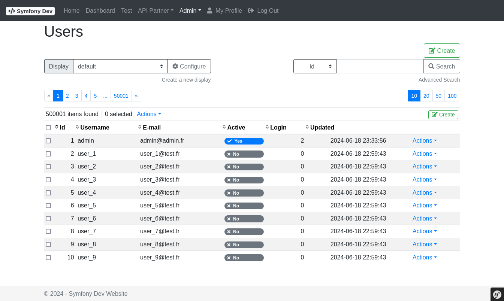
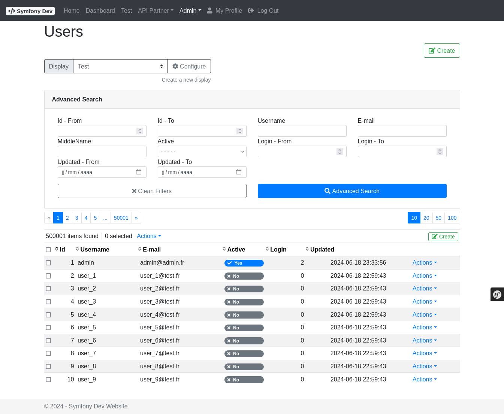
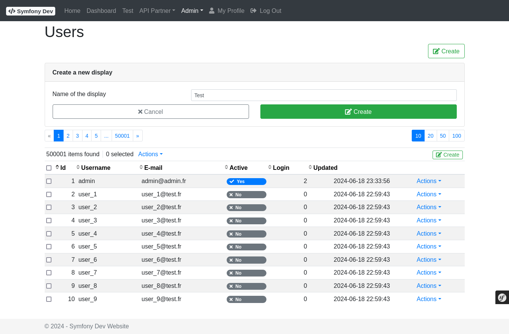
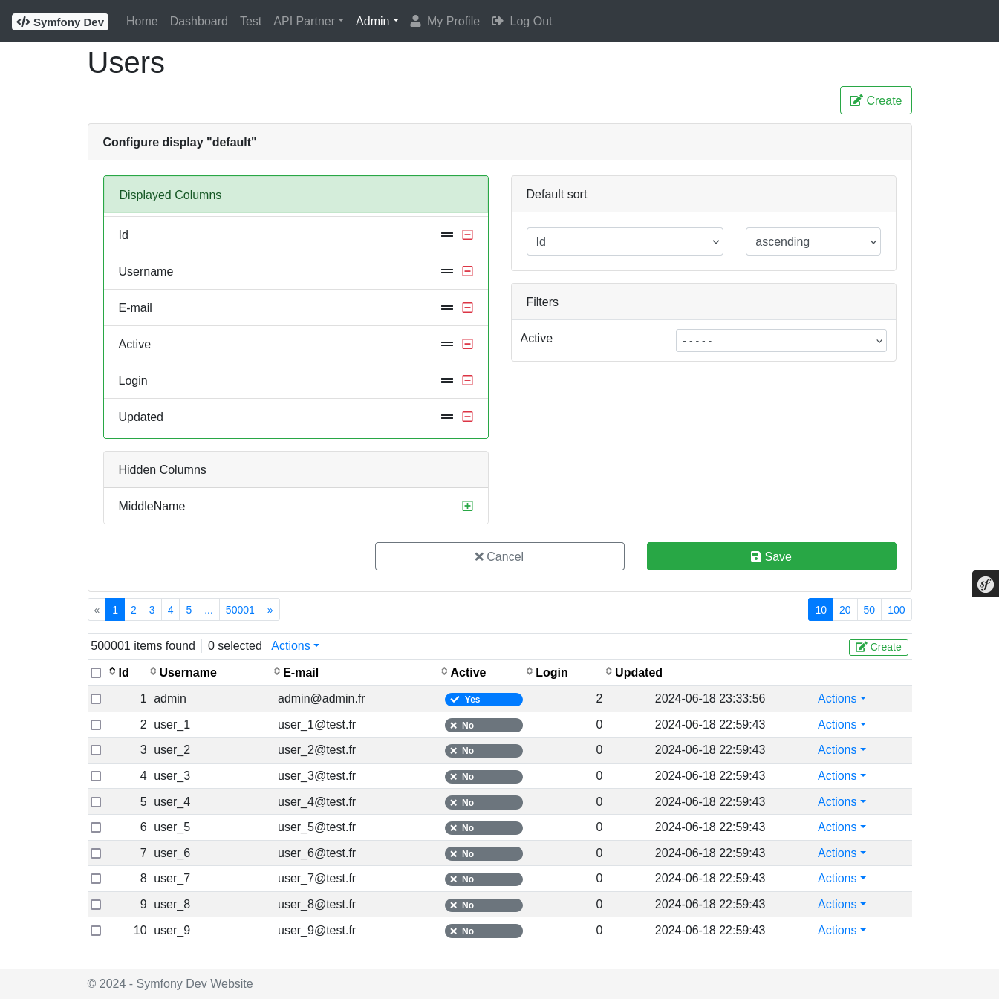

# Bundle - Ui

## Description

The **UiBundle** provides a reusable admin UI framework built on Twig, Bootstrap 5, and Symfony Form:

- **Grid / List** — paginated, sortable, filterable data grids with configurable columns, row/mass/global actions, and per-user column personalization
- **Form Management** — structured form definitions (`Form` / `FieldSet` / `Field`) with Symfony form type integration, lifecycle events, and automatic entity persistence
- **Read-Only View** — same definition used by `ShowFactory` to render an entity in read-only mode
- **Menu** — hierarchical navigation menu with role-based access control
- **Options** — `OptionsInterface` / `AbstractOptions` for controlled key-label lists used in grids and forms
- **Twig Extensions** — `renderManager`, `getMenu`, `getTranslations` functions; `label_from_option`, `label_from_option_name` filters
- **Entity Traits** — `EntityInterface`, `TimestampableTrait` / `TimestampableInterface` for Doctrine entities
- **Custom Form Types** — `IntegerUnitType` and `NumberUnitType` for inputs with unit suffixes

Full documentation: [README.md](https://github.com/spipu/symfony-bundle-ui/blob/master/README.md)

## Screenshots

