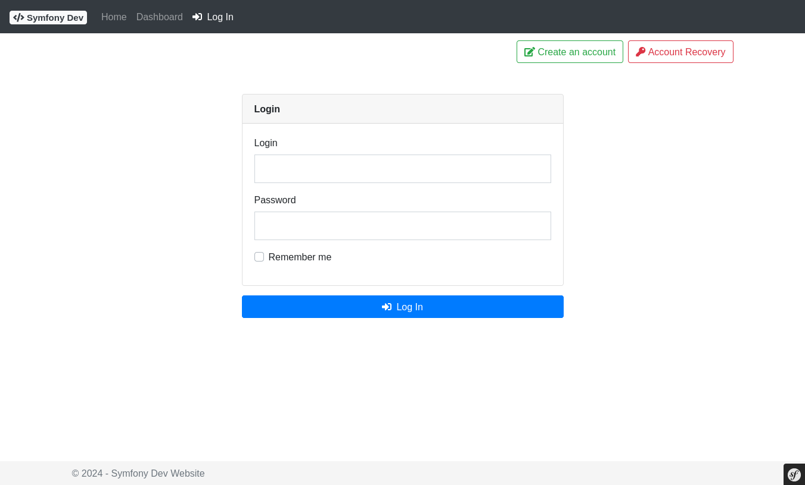
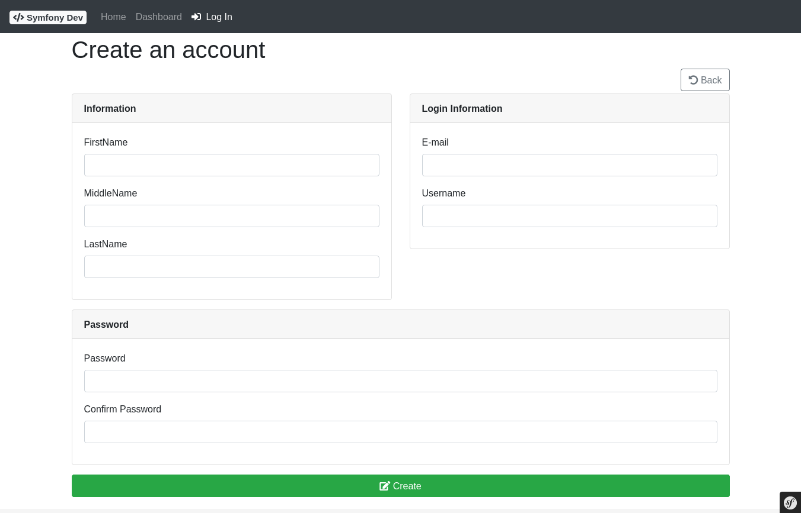
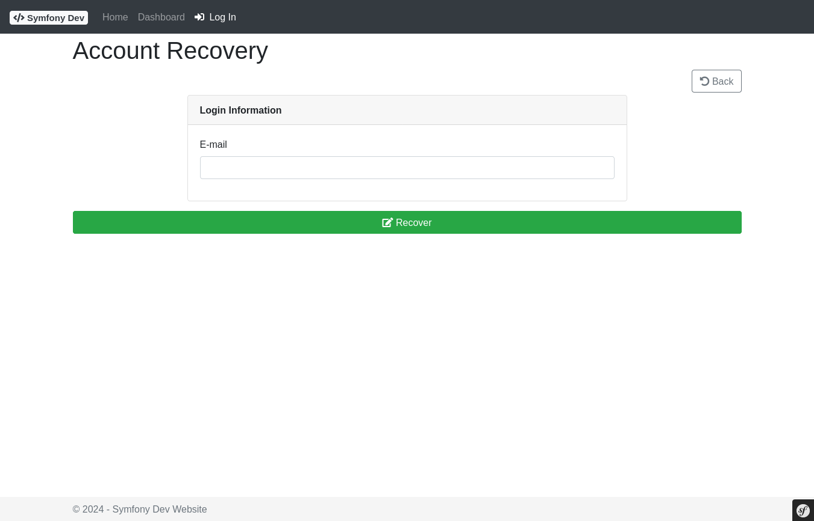
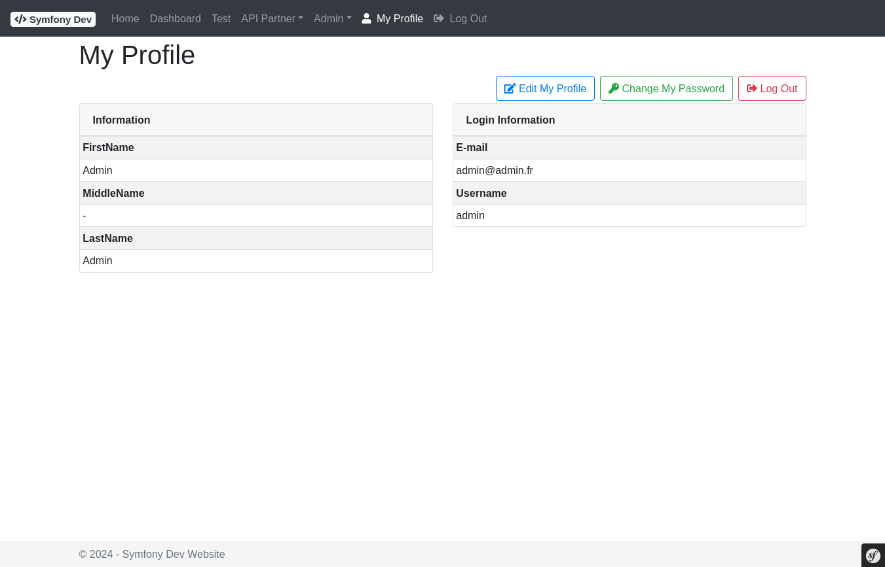
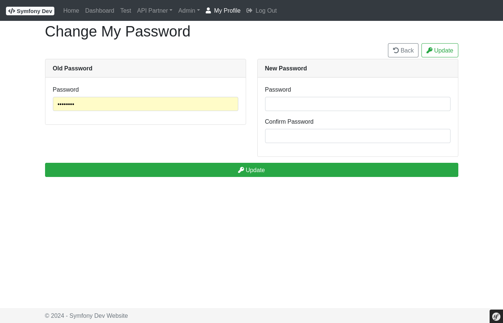
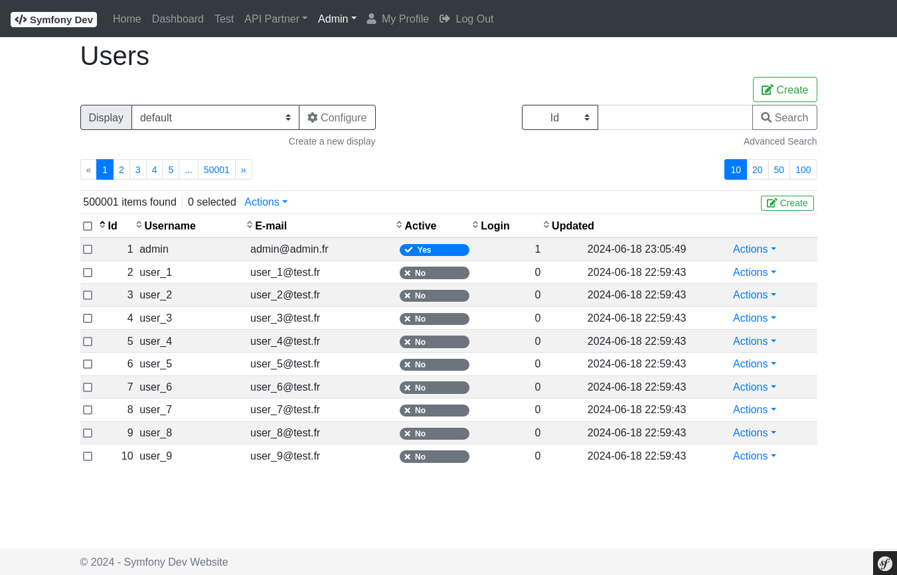
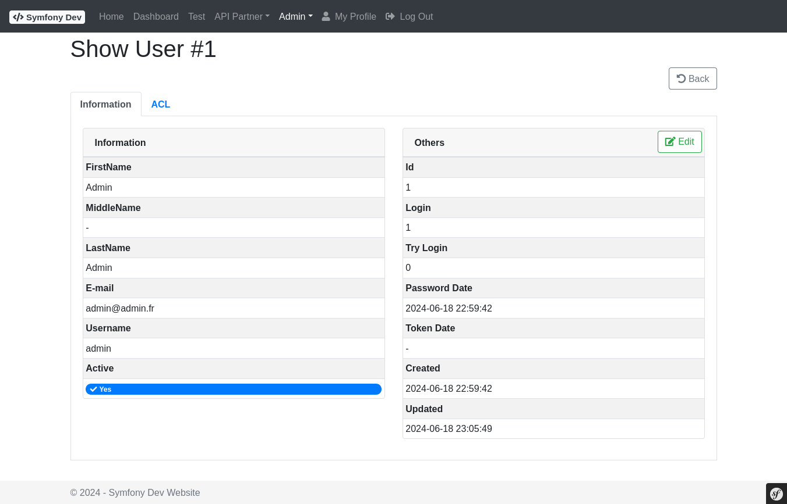
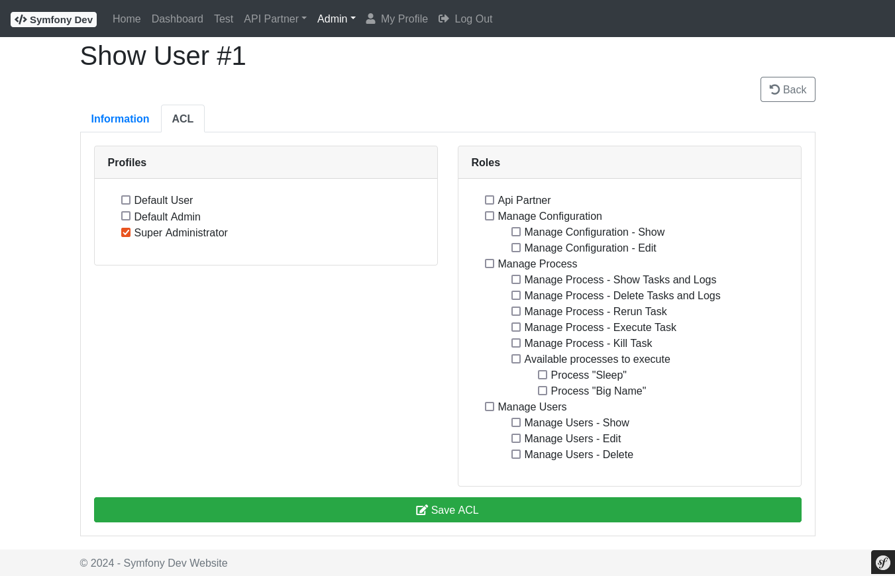

# Bundle - User

## Description

The **UserBundle** provides a complete user management system for Symfony applications:

- **User entity** (`AbstractUser`) — email, username, first/last name, active flag, login counters (`nbLogin`, `nbTryLogin`)
- **Authentication** — Symfony Security integration (form login, `UserChecker`, remember-me)
- **Registration** — optional self-registration with email activation link and token-based confirmation
- **Password recovery** — optional forgot-password flow with token-based email link
- **Admin UI** — list, show, create, edit, enable/disable, delete, role assignment, and password reset at `/user/`
- **Login tracking** — `nbLogin` incremented on success; `nbTryLogin` incremented on failure
- **Role hierarchy** — contributes `ROLE_ADMIN_MANAGE_USER_SHOW`, `ROLE_ADMIN_MANAGE_USER_EDIT`, `ROLE_ADMIN_MANAGE_USER_DELETE`, `ROLE_ADMIN_MANAGE_USER`
- **Events** — `UserEvent` dispatched on registration, confirmation, password recovery, profile edit, and password change

Full documentation: [README.md](https://github.com/spipu/symfony-bundle-user/blob/master/README.md)

## Screenshots

